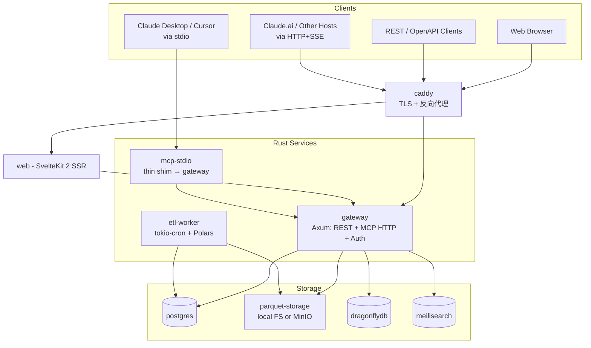
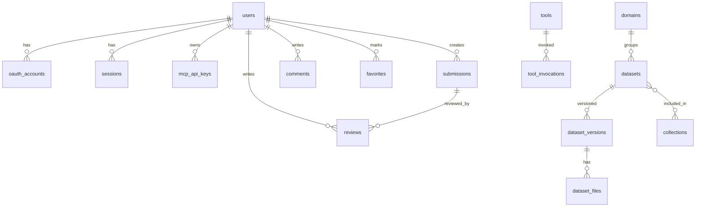
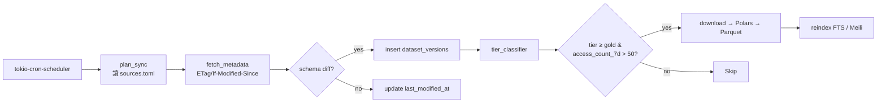
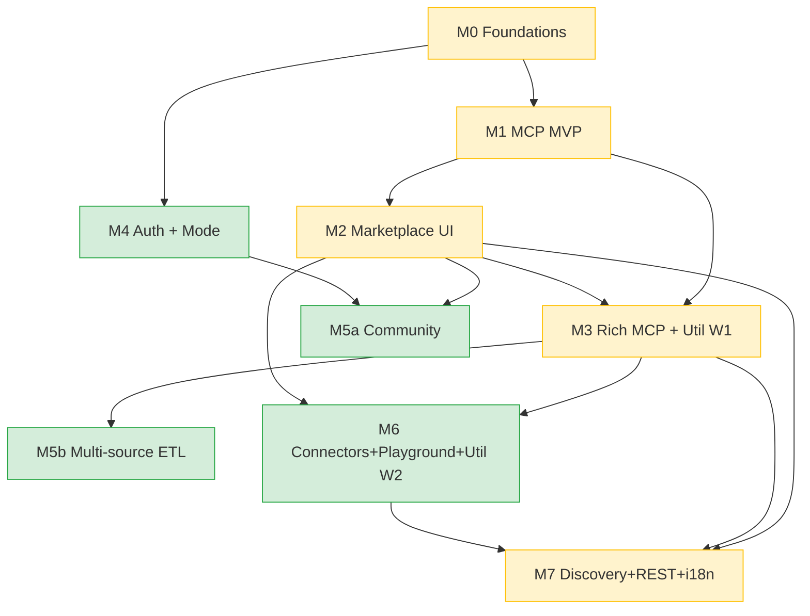

# Taiwan Data Hub — 開源版完整設計文件

> 取代 https://hub.twinkleai.tw/ 的完全開源、可自託管實作
> Working name: `taiwan-data-hub` · License: Apache-2.0
> 日期：2026-05-18

---

## 1. Context（為什麼做這件事）

### 1.1 問題與動機
- **Twinkle Hub** 是台灣公開資料的 **MCP（Model Context Protocol）服務聚合平台**，把 `data.gov.tw` 的 52,960 筆資料集鏡像、自動分類成 20 個 domain，供 Claude / Cursor / Gemini 等 AI agent 透過 MCP 直接呼叫。
- 經 `/pricing` 與 `/.well-known/mcp.json` 證實，原網站採 **按 tool call 計費**（`list_domains` $0.0005、`search_datasets` $0.001、`get_dataset` $0.001、`query_rows` $0.005、`materialize_dataset` $0.01）。Alpha 期免費，未來分 Free / Starter / Pro tier。
- 原宣稱的開源 repo `github.com/lianghsun/twinkle-hub` **不存在**；唯一公開的 `lianghsun/taiwan-gov-redesigns`（MIT）只是 10 筆 demo dataset 的設計 prototype，且 2026-04-30 後未更新。正式版顯然已脫離該 repo，核心邏輯**非開源**。
- 我們希望建立**完全開源、永久免費、可自託管**的替代品，並提供原版沒有的功能：使用者貢獻、社群討論、收藏、多資料源（不只 `data.gov.tw`）。

### 1.2 預期成果
- 任何人 `git clone` 後 `docker compose up` 就有一個可用的 Taiwan Data Hub。
- AI agent（Claude Desktop、Cursor、Cline）可透過 stdio 或 HTTP/SSE 接到自託管實例。
- 對普通網頁訪客而言，瀏覽、搜尋體驗等同或優於原版。
- 對社群而言，提交新 dataset / tool / connector / playground 有正式流程。

---

## 2. 探索摘要（從原網站盤點）

### 2.1 必須對等的功能
| 功能 | 規模 | 備註 |
|---|---|---|
| Dataset marketplace | 20 個 domain × 52,960 筆 dataset | Topical 16 / Meta 1 / Horizontal 2；含白金/金 tier、3 個 curated collection |
| MCP server | 5 個 base tool | `list_domains` / `search_datasets` / `get_dataset` / `query_rows` / `materialize_dataset` |
| Utility tools | 53 個 | TW-specific 為主（身分證、統編、ROC 年、地址、行政區、MRT、銀行代碼、郵遞區號、節氣、農曆…） |
| Connectors registry | 8 個 | Playwright / Chrome DevTools / n8n / Notion / Sentry / Google / Sequential Thinking / Context7（只是安裝指南，非代理） |
| Playground | 5 個 demo | Company 360、司法統計、台灣鄉鎮地圖、房價熱圖、採購戰情室 |
| Agent discovery | 6 個檔案 | `/llms.txt`、`/.well-known/mcp.json`、`/.well-known/agent-card.json`、`/.well-known/agent-skills.json`、`/.well-known/api-catalog` (RFC 9727)、`/.well-known/oauth-protected-resource` (RFC 9728) |
| REST API + OpenAPI 3.1 | — | 給非 MCP 客戶端 |
| i18n | 5 語言 | zh-TW（主）、en、ja、ko、fr |

### 2.2 超越原版的功能（開源版差異化）
- **使用者貢獻系統**：submit dataset / tool / connector / playground + 審核流程
- **社群層**：評論、收藏、5 星評分、舉報
- **多資料源 ETL**：TWSE、MOEA Business Registry、CWA（中央氣象署）、Fishery (MOA)
- **個人模式 vs 多人模式**：可整個關閉 auth 跑單機個人版

---

## 3. 已確定的設計決策

| 維度 | 決策 | 理由 |
|---|---|---|
| **定位** | 超越原版（功能對等 + 社群 + 多資料源） | 使用者明確選擇 |
| **部署** | Self-hosted Docker Compose | 完全可控、不綁雲端供應商 |
| **資料策略** | Hybrid：metadata 全鏡像 + 熱門 dataset 本地 Parquet 快取 | 兼顧儲存成本與查詢效能 |
| **認證** | Email 密碼 + GitHub/Google OAuth 雙軌；可關閉跑個人模式 | 大眾與開發者通吃 |
| **後端** | **Rust**（Axum 0.8 + Polars 0.53 + sqlx 0.8 + PostgreSQL 18） | CLAUDE.md 偏好；release build 體積小、效能優 |
| **前端** | **SvelteKit 2 + Svelte 5 (Runes) + Tailwind 4 + shadcn-svelte 1** | 體積小、SSR 好、避免 Next.js 多餘 runtime |
| **授權** | Apache-2.0 | 包含專利條款、社群接納度高 |
| **MCP 範圍** | 5 base + Rich tools（join、aggregate、resources、prompts、**elicitation**） | 對齊 MCP **2025-11-25** spec，含 tool annotations 信任模型 |

---

## 4. 系統架構

### 4.1 Container-level 元件圖



### 4.2 服務職責與必要性

| 服務 | 職責 | 必要性 |
|---|---|---|
| `gateway` (Axum) | REST、MCP HTTP+SSE、OAuth 2.1 + DCR、認證、rate limit、Parquet 查詢 | **必要** |
| `mcp-stdio` | stdin/stdout JSON-RPC shim → 轉內部 HTTP；發布 npm 與 cargo | **必要**（Claude Desktop 唯一管道） |
| `web` (SvelteKit 2 SSR) | Marketplace、playground、utilities UI、i18n | **必要** |
| `etl-worker` | tokio-cron 排程鏡像上游、轉 Parquet、tier 評分 | **必要** |
| `postgres` 18 | 唯一 source of truth（metadata + users + submissions + usage）；用 UUIDv7 內建 | **必要** |
| `parquet-storage` | 熱門 dataset 快取（dev=bind mount, prod=**SeaweedFS** 或 **Garage** S3-相容 / MinIO 已封存不採用） | **必要** |
| `caddy` | 自動 TLS + HTTP/2/3 反向代理 | 生產必要；dev 可省 |
| `dragonflydb` | session、rate-limit token bucket、MCP 結果短期快取 | 可選（小規模可用 PG advisory locks 代替） |
| `meilisearch` | 全文檢索 + facet | 可選（MVP 用 PG `tsvector` + `zhparser`） |
| `otel-collector` + `prometheus` | 觀測 | 可選 |

**MVP 三服務**：`gateway` + `web` + `postgres` 即可跑。其他服務透過 Docker Compose `profiles:` 開關（`default` / `full` / `obs` / `dev`）。

### 4.3 資料模型（核心表）



**關鍵欄位設計**：
- 多語欄位一律 `jsonb`（`{"zh-TW":"…","en":"…"}`），避免每張表 join 翻譯表。
- `datasets.source` 列舉：`data_gov_tw` / `twse` / `moea` / `cwa` / `user_contrib`。
- `datasets.tier`：`platinum / gold / silver / bronze`（可手動 override）。
- `dataset_files.uri` 抽象 storage：`file://`, `s3://`, `https://`。
- `usage_records` 月分區，免費也記用於濫用偵測 + 公開統計。
- `datasets.tsv tsvector`：MVP 用 PG FTS（需 `zhparser` 或 `pg_jieba`）。

### 4.4 MCP Server 介面

**Transport**（MCP 2025-11-25 spec）：
- `POST /mcp` — Streamable HTTP
- `GET /mcp` — SSE upgrade（backward compat）
- stdio：透過 `mcp-stdio` shim
- 充分利用新規格：**elicitation**（agent 反問使用者）、**tool annotations**（標 `read-only` / `destructive` / `idempotent` 信任提示）、**resource roots**（暴露 dataset 樹狀結構）

**Auth**：
- OAuth 2.1 + PKCE S256（強制）
- Dynamic Client Registration（DCR，RFC 7591）
- `/.well-known/oauth-protected-resource` + `/.well-known/oauth-authorization-server`
- 個人模式：`AUTH_MODE=none`，所有呼叫匿名 + IP rate limit

**5 個 base tools**（與 Twinkle 1:1 對等）：
| Tool | 用途 |
|---|---|
| `list_domains` | 列出 20 個 domain + dataset 數 |
| `search_datasets` | 多條件搜尋（q / domain / tier / locale） |
| `get_dataset` | 完整 metadata + schema + 版本歷史 |
| `query_rows` | 對 Parquet 跑 SQL（限 SELECT、`LIMIT≤10000`、AST 白名單） |
| `materialize_dataset` | 產生 CSV/Parquet/JSON 下載 signed URL |

**Rich tools 擴充**（差異化）：
- `join_datasets`：跨 dataset 用共通 key（區碼、統編）做 inner/left join，Polars 後端
- `aggregate_dataset`：group_by + agg（sum/mean/count/median）
- `compare_periods`：同 dataset 不同版本/期間差異
- `geocode_admin`：地址 → 鄉鎮區碼（接 utility tools）
- `validate_tw_id` / `roc_date_convert`：將 utility 直接暴露成 MCP

**Resources & Prompts**：
- Resources：每個 dataset schema 暴露為 `dataset://{id}/schema`，讓 agent prefetch
- Prompts：5 個查詢範例（「找最近颱風路徑」「比較各縣市出生率」），降低 onboarding 門檻

### 4.5 ETL Pipeline



**排程**：
- Metadata 全量 nightly 02:00 Asia/Taipei，用 ETag/`If-Modified-Since` 做增量
- 熱門 dataset 每 6 小時檢查；冷門每週
- 由 `config/sources.toml` 宣告，每個來源實作 `trait SourceConnector`

**Tier 自動分類**：
```
score = 0.4 × update_frequency_score
      + 0.3 × publisher_authority   -- 中央 > 地方 > 法人
      + 0.2 × format_quality        -- CSV/JSON > XML > PDF
      + 0.1 × recent_access_count_normalized
platinum > 0.85 · gold > 0.7 · silver > 0.5 · else bronze
```
策展人可在 `datasets.tier_override` 手動覆蓋。

**快取生命週期**：
- `tier ∈ {platinum, gold}` 自動快取
- 任何 dataset 7 日 `query_rows` > 50 次 → promote 為快取
- 超過 30 日無存取 → demote（刪 Parquet 但留 metadata）

### 4.6 Repo 結構（Monorepo）

```
taiwan-data-hub/
├── Cargo.toml                          # workspace
├── crates/
│   ├── gateway/                        # Axum app（bin）
│   ├── mcp-stdio/                      # stdio shim（bin, npm + cargo 雙發布）
│   ├── etl-worker/                     # 排程鏡像（bin）
│   ├── mcp-core/                       # MCP protocol types + dispatcher（lib）
│   ├── tools-utility/                  # 53 個 TW utility 純函式（lib）
│   ├── tools-data/                     # base + rich data tools impl
│   ├── connectors/                     # SourceConnector trait + 各 source impl
│   ├── storage/                        # sqlx repos + Parquet IO
│   ├── auth/                           # password + OAuth + sessions + DCR
│   ├── shared/                         # error, telemetry, config, i18n loader
│   └── test-support/                   # testcontainers helpers
├── web/                                # SvelteKit 2
│   ├── src/lib/                        # components, stores, OpenAPI client
│   ├── src/routes/                     # marketplace, datasets, tools, playground
│   └── messages/                       # Paraglide i18n: zh-TW/en/ja/ko/fr
├── migrations/                         # sqlx-cli SQL migrations
├── docker/
│   ├── Dockerfile.gateway
│   ├── Dockerfile.web
│   ├── Dockerfile.etl
│   ├── compose.yaml
│   ├── compose.dev.yaml
│   └── compose.obs.yaml
├── config/
│   ├── sources.toml                    # ETL source 宣告
│   ├── tiers.toml                      # tier 評分權重
│   └── domains.yaml                    # 20 個 domain seed
├── docs/
│   ├── architecture.md
│   ├── mcp-spec.md
│   ├── contributing.md
│   └── deploy.md
└── scripts/seed.rs                     # 初始化 domains/collections/utility
```

### 4.7 部署拓樸（Docker Compose）

```yaml
services:
  caddy:           # profile: prod          (caddy 2.11.x)
  gateway:         # 8080
  web:             # 3000
  etl-worker:
  postgres:        # pgdata volume          (postgres 18.x)
  dragonfly:       # profile: full          (dragonflydb 1.36.x)
  meilisearch:     # profile: full          (meilisearch 1.15.x)
  seaweedfs:       # profile: full          (S3-compat; 替代已封存的 MinIO)
  otel-collector:  # profile: obs           (otel-collector core 1.49)
  prometheus:      # profile: obs
```

- **Profiles**：`default` (gateway+web+postgres+etl) / `full` / `obs` / `dev`
- **Network**：單一 `internal` bridge，只有 `caddy` 對外
- **Secrets**：`.env` + Compose `secrets:`；生產建議外掛 SOPS / age 加密
- **Healthchecks**：每服務都實作 `/healthz` (liveness) + `/readyz` (readiness)
- **dev vs prod**：dev 用 `cargo watch` + bind mount；prod 用 multi-stage build (`cargo chef`) + distroless runtime + 唯讀 rootfs

---

## 5. 關鍵函式庫選擇（版本驗證至 2026-05-18）

### 5.1 Rust crates

| 領域 | 選擇 | 版本 | 備註 |
|---|---|---|---|
| HTTP server | `axum` | **0.8.8** | ⚠️ 0.8 path syntax：`/:id` 改為 `/{id}`（舊語法會 panic）；`middleware::from_fn` 已 inline 進主 crate |
| Async runtime | `tokio` | **1.52.x**（LTS 1.51） | 仍 1.x 穩定，2.0 仍在討論 |
| DB driver | `sqlx` | **0.8.6** | 編譯期 SQL 檢查、PG-native（jsonb/tsvector） |
| Migrations | `sqlx-cli` | 同 sqlx | — |
| DataFrame | `polars` | **0.53.0** | Rust crate 仍 0.x；Parquet/CSV/JSON 原生、SQL context、lazy 執行、Arrow zero-copy |
| MCP SDK | `rmcp` | **1.7.0** | ⚠️ 已 1.x（前身 0.x API 不相容）；採 tokio-async-traits |
| 密碼雜湊 | `argon2`（RustCrypto） | **0.5.3**（注意 0.6 RC 將至） | OWASP 推薦 |
| OAuth client | `oauth2` | **5.x** | ⚠️ Major bump：async client 改 trait-based、URL/Token 型別更嚴格 |
| OIDC | `openidconnect` | **5.x** | ⚠️ Major bump（與 oauth2 5.x 同步） |
| Cron | `tokio-cron-scheduler` | **0.15.1** | 純 Rust、無外部依賴 |
| Config | `figment` | **0.10.19** | toml + env + secret 合併乾淨 |
| Validator | `garde` | **0.22.0** | derive 體驗好 |
| Errors | `thiserror`（lib）+ `anyhow`（bin） | **thiserror 2.0.18** / **anyhow 1.1.0** | ⚠️ thiserror 2.0 改 derive 後端與 `From` 邏輯；多數場景重編即可 |
| Serde | `serde` | **1.0.228** | 完全相容 |
| Telemetry | `tracing` + `tracing-opentelemetry` + `opentelemetry-otlp` | tracing 0.1.x / otel-otlp 0.15 / opentelemetry-sdk 0.22（注意版本鎖矩陣） | OTLP 已升 1.9.0，新加 profiles 支援 |
| Metrics | `metrics-exporter-prometheus` | **0.18.1** | — |
| OpenAPI 產生 | `utoipa` + `utoipa-axum` | **utoipa 5.5.0** / **utoipa-axum 0.2.x** | ⚠️ Major bump（OpenAPI 3.1、`OpenApiRouter` 取代直接用 axum Router） |
| Rate limit | `tower-governor` | **0.3.x / 0.4 線** | Token bucket、governor 內核穩定 |
| SQL AST 驗證 | `sqlparser` | **0.61.0** | 新增 dialect 支援，破壞變更在 AST node |
| Test infra | `testcontainers` + `insta` | **0.27.3** / **1.46.0** | 真實 PG；建議搭 `testcontainers-modules` |
| 加密 | `aes-gcm` | **0.10.3** | 已穩定 |
| 檔案類型偵測 | `infer` | **0.19.0** | magic byte 檢查 |

### 5.2 前端 npm packages

| 領域 | 選擇 | 版本 | 備註 |
|---|---|---|---|
| 框架 | `@sveltejs/kit` + `svelte` | **kit 2.59.1** + **svelte 5.55.7** | ⚠️ Svelte 5 **Runes** 強制：`$state` / `$derived` / `$effect` / `$props`，舊的 `$:` 與 `export let` 廢棄；近期加入 "remote functions" |
| CSS | `tailwindcss` | **4.3.0** | ⚠️ Major bump (v4)：CSS-first config（`@theme` 取代 `tailwind.config.js`）、`@import "tailwindcss"` 取代 `@tailwind`、PostCSS plugin 改為 `@tailwindcss/postcss`、`shadow` 階級重命名（`shadow-sm` → `shadow-xs`）、`border` 預設 `currentColor`；需 Safari 16.4+ / Chrome 111+ |
| UI 元件 | `shadcn-svelte` + `bits-ui` | **shadcn-svelte 1.2.7** + **bits-ui 2.18.1** | ⚠️ 兩者皆 Major bump：bits-ui v2 為對應 Svelte 5 Runes 重整 headless primitives |
| i18n | `@inlang/paraglide-js` | **2.18.0** | ⚠️ Major bump：API 重命名 `languageTag()` → `getLocale()`、`setLanguageTag()` → `setLocale()`、`availableLanguageTags` → `locales`；server middleware 移到 `server.js` 成 `paraglideMiddleware` |
| 地圖 | `maplibre-gl` | **5.24.0** | ⚠️ Major bump (v5)：重整型別、worker、style spec；v6 在 prerelease |
| Charts | `echarts` + 自寫 Svelte wrapper（30 行） | **echarts 6.0.0** | ⚠️ **不要用** `svelte-echarts`（1.0.0 一年未更新，不跟 Svelte 5 / echarts 6）；自己 wrap 比較安全 |
| MCP 工具 | `@modelcontextprotocol/sdk` + `@modelcontextprotocol/inspector` | **sdk 1.29.0** + **inspector 0.21.2** | ⚠️ sdk 1.x（過 0.x 後）API 已重整 |

### 5.3 基礎設施軟體

| 領域 | 選擇 | 版本 | 備註 |
|---|---|---|---|
| RDBMS | **PostgreSQL** | **18.x** | ⚠️ 從原規劃 16 升級兩版：18 帶 async I/O、UUIDv7、virtual generated columns；19 計劃 2026-09 |
| Cache | **DragonflyDB** | **1.36.11** | Redis API 相容、cluster mode 成熟 |
| Search | **Meilisearch** | **1.15.x** | 仍 v1.x，無 v2 |
| Object storage | ⚠️ **SeaweedFS**（推薦）或 **Garage** | SeaweedFS 3.x / Garage 1.x | ⚠️ **MinIO 已於 2026-04-25 封存（archived）**，社群版凍結，主推商業 AIStor。改用 SeaweedFS 或 Garage（兩者皆原生支援 S3 API、Apache-2.0/AGPL 授權） |
| 反向代理 | **Caddy** | **2.11.3** | 仍 2.x；新加 global DNS option、ACME profiles |
| Observability | **OpenTelemetry Collector** | core **1.49** / contrib 0.152 | core 已 1.x 穩定 |

### 5.4 規格相容

| 規格 | 版本 | 備註 |
|---|---|---|
| **MCP Spec** | **2025-11-25** | ⚠️ 從 2025-06-18 跳兩版；新版加入 elicitation、tool annotations 信任模型、resource roots 機制；schema 路徑 `schema/2025-11-25/schema.ts` |
| OpenAPI | **3.1** | 由 `utoipa` 產生 |
| OAuth | **2.1**（with PKCE S256） | DCR (RFC 7591) + RFC 9728 |

### 5.5 Major bump 變動清單（實作時務必注意）

實作前請對照以下重點變動，避免抄到舊版範例：

1. **axum 0.8**：所有 `/:param` → `/{param}`，否則啟動 panic
2. **rmcp 1.x**：與 0.x API 不相容，trait 簽名與 import path 都改
3. **utoipa 5.x**：`OpenApiRouter` 取代手寫 axum Router 套 derive，OpenAPI 3.1 schema 路徑改
4. **oauth2/openidconnect 5.x**：async client 改 trait-based
5. **thiserror 2.0**：多數重編即可，但 `#[backtrace]` 等高階屬性要對 changelog
6. **Tailwind v4**：刪 `tailwind.config.js`，改用 `@theme` 區塊在 CSS 中宣告 design tokens
7. **Svelte 5 Runes**：全部 component 用 `$state`/`$derived`/`$effect`/`$props`
8. **shadcn-svelte v1 + bits-ui v2**：原本 0.x 的 component API 全變
9. **Paraglide-JS v2**：i18n call site 全部重命名（grep & replace）
10. **MapLibre GL v5**：style spec 與 worker config 結構變
11. **echarts v6**：v5 → v6 不完全相容，需參遷移指南
12. **MinIO 封存**：技術選型直接換掉，不要再用
13. **PG 18**：可直接享用 UUIDv7（`uuidv7()` 內建），有序又分散
14. **MCP Spec 2025-11-25**：rich tools 應充分利用新加的 elicitation 與 tool annotations

確保 `Cargo.toml` 含 CLAUDE.md 指定的 dev profile：
```toml
[profile.dev.package."*"]
debug = false
```

---

## 6. 安全與觀測

### 安全
- **Rate limit**：`tower-governor`，三層 — IP (60 req/min) / API key (依 tier) / tool-level（`query_rows` 嚴格）
- **SQL 注入**：所有 DB 查詢經 sqlx 編譯期檢查；`query_rows` 使用者 SQL 走 `sqlparser-rs` AST 驗證白名單（僅 SELECT、限制函式、強制 LIMIT）
- **CSRF**：SvelteKit `csrf.checkOrigin: true` + double-submit cookie
- **檔案上傳**：MIME 白名單 + size cap 10 MB + `infer` crate magic byte 檢查 + ClamAV sidecar（可選 profile）
- **OAuth 2.1 PKCE**：所有 MCP client 強制 PKCE S256；不接受 implicit；token TTL 短（1h access、14d refresh），refresh rotation
- **Secret 加密**：DB 中 OAuth token 以 `aes-gcm` + env KEK 加密；不落 log
- **Headers**：HSTS、CSP（SvelteKit nonce）、Referrer-Policy、X-Content-Type-Options
- **Audit log**：admin 動作 + submission decision 全記 `audit_logs` 表，append-only

### 觀測性
- **Logs**：`tracing` JSON 到 stdout → Loki/Vector；每 request 帶 `request_id`/`user_id`/`api_key_id`/`tool_key`/`dataset_id`
- **Metrics**：`metrics-exporter-prometheus`；關鍵 — `http_requests_total{route,status}`、`mcp_tool_duration_seconds{tool}`、`etl_sync_duration_seconds{source}`、`dataset_cache_hit_ratio`、`parquet_storage_bytes`
- **Traces**：OTLP gRPC → collector；axum middleware 自動 span；sqlx 用 `tracing-instrument`
- **個人模式**：`OBSERVABILITY=off`，全部 no-op

---

## 7. 風險與 Trade-off

| # | 風險 | 緩解 |
|---|---|---|
| 1 | **Polars SQL 對使用者輸入的安全邊界**：`query_rows` 接 SQL 字串，AST 過濾有漏洞風險 | 白名單表名（只查 `current_dataset`）、強制 `LIMIT≤10000`、`streaming + memory_limit`、tokio `timeout(5s)`、worker pool 隔離；長期可改純 DSL（JSON filter）不開放 SQL |
| 2 | **MCP 規格演進快**：rmcp 跟不上會卡 | `mcp-core` 自封裝 protocol types，rmcp 1.x 當 transport adapter；CI 每週跑 `@modelcontextprotocol/inspector` 做契約測試；目標對齊 2025-11-25 spec |
| 3 | **data.gov.tw 上游不穩 / schema 漂移** | ETL 全程記版本 + checksum，舊版可回溯；schema diff 自動降 tier + 警示；`SourceConnector` 抽象讓社群替換實作；支援「快照 mode」 |
| 4 | **i18n × jsonb 索引複雜** | MVP 只索引 zh-TW + en；其他語言走 fallback `COALESCE(title_i18n->>$lang, title_i18n->>'zh-TW')`；引入 Meili 後每語言一個 index |
| 5 | **「個人模式」與「公開模式」配置分歧** | 單一 `config.toml` + `mode = "personal" \| "public"` 預設集；CLI `taiwan-data-hub doctor` 驗證一致性；CI 對兩種 mode 都跑 e2e |
| 6 | **53 個 utility tool 工作量被低估**：TW-specific 約每個 0.5-1 天，generic 的（geo、stats、time series）每個 2-3 天 | 實際估 50-70 工作天；拆分為 wave 1 (20) + wave 2 (33)；設 `good-first-issue` 標籤吸引社群 |
| 7 | **moderation queue 無自動化會吃光 maintainer 時間** | M5a 完成後立即開「Auto-moderation heuristics」issue（spam filter / auto-label / 信任分數） |
| 8 | **Docker Compose 上 production 距離比想像遠**：backup、log rotation、TLS、secret、升級 | M0 只做「能跑」；v0.1 release 前補一個 M0.5 隱藏 milestone 處理 ops |
| 9 | **上游軟體可能停止維護**（如 MinIO 在 2026-04-25 被官方封存） | 所有第三方軟體都在 `docker/compose.yaml` 中註記版本與替代品；object storage 直接選 **SeaweedFS** 而非 MinIO；架構抽象化（`dataset_files.uri` 走 S3 API）讓未來替換成本可控 |
| 10 | **新版函式庫破壞性變動**：axum 0.8 path syntax / Tailwind v4 CSS-first / Svelte 5 Runes / Paraglide v2 API rename / MCP spec 跳兩版 | 設計文件已對照 2026-05 最新版本確認；contributor onboarding doc 列出「不要抄到舊版範例」清單；CI 用 `cargo deny` 與 `npm audit` 鎖版本 |

---

## 8. 里程碑（Milestones）



| M# | 名稱 | 目標 | 複雜度 | 依賴 |
|---|---|---|---|---|
| M0 | Foundations | Repo / CI / Docker / health-check 到位 | M | — |
| M1 | MCP MVP | 5 個 base MCP tool + data.gov.tw metadata ingest | L | M0 |
| M2 | Marketplace UI | 20 domain 瀏覽 + dataset 詳情 + collection | L | M1 |
| M3 | Rich MCP + Utility Wave 1 | Rich tools + 20 個 TW utility + 熱門 cache | XL | M1, M2 |
| M4 | Auth + Mode Switch | Email + OAuth 雙軌 + personal/multi-user 切換 | L | M0（可與 M1-M3 平行） |
| M5a | Community | Submission / moderation / comments / favorites / ratings | XL | M2, M4 |
| M5b | Multi-source ETL | TWSE + MOEA + CWA + Fishery connector | XL | M3 |
| M6 | Connectors + Playground + Utility Wave 2 | 8 connector + 5 playground + 33 utility | L | M3 |
| M7 | Agent Discovery + REST + i18n | `/llms.txt` + `/.well-known/*` + OpenAPI + 5 語言 | L | M2, M3, M6 |

### MVP 定義（v0.1）= M0 + M1 + M2

**為什麼**：v0.1 要驗證「AI agent 透過 MCP 拿 data.gov.tw 資料，比直接 scrape 好用嗎？」這個核心假設。M0+M1+M2 形成最小可分享 demo：marketplace 瀏覽 → 複製 MCP config → Claude Desktop 試用 → 回來貢獻 issue。
- **v0.5（社群版）= + M3 + M4 + M5**：能跑社群、形成護城河
- **v1.0（完整版）= 全部 M0-M7**：完全對等且超越原版

---

## 9. Sub-issues 拆分（全部 8 個 milestones）

### M0 — Foundations（8 issues）

| # | Title | Labels | Est |
|---|---|---|---|
| 0.1 | Bootstrap Cargo workspace with `gateway`, `mcp-stdio`, `etl-worker`, `mcp-core`, `tools-utility`, `connectors`, `storage`, `auth`, `shared` crates | backend, infra | S |
| 0.2 | Scaffold SvelteKit 2 app with Tailwind + shadcn-svelte | frontend | S |
| 0.3 | Write `docker/compose.yaml` with PostgreSQL 18 + healthchecks + named volumes | infra | M |
| 0.4 | Add `/healthz` (liveness) + `/readyz` (readiness) endpoints | backend | XS |
| 0.5 | Set up GitHub Actions: fmt / clippy / cargo test / svelte-check / prettier | infra | M |
| 0.6 | Add Apache-2.0 LICENSE + CONTRIBUTING.md + CODE_OF_CONDUCT.md | docs | S |
| 0.7 | Add issue templates (bug / feature / dataset-request) + PR template | docs, infra | XS |
| 0.8 | Initial sqlx migration (`domains`, `datasets`, `dataset_versions`, `dataset_files`) | backend | S |

### M1 — MCP MVP（10 issues）

| # | Title | Labels | Est |
|---|---|---|---|
| 1.1 | Implement `rmcp`-based MCP server skeleton with stdio transport | mcp, backend | M |
| 1.2 | Add HTTP/SSE transport for MCP (`POST /mcp` + `GET /mcp` SSE upgrade) | mcp, backend | M |
| 1.3 | Implement `list_domains` tool (seeded from `config/domains.yaml`) | mcp | S |
| 1.4 | Build data.gov.tw catalog crawler (metadata only) in `connectors/data-gov-tw` | etl, backend | L |
| 1.5 | Implement `search_datasets` tool with PG FTS (`tsvector` + GIN + zhparser) | mcp, backend | M |
| 1.6 | Implement `get_dataset` tool（完整 metadata + schema + 版本歷史） | mcp | S |
| 1.7 | Implement `query_rows` tool with Polars + sqlparser-rs AST 白名單 | mcp, backend | L |
| 1.8 | Implement `materialize_dataset` tool（signed URL 下載） | mcp | M |
| 1.9 | Write MCP integration tests using `rmcp` test harness + `@modelcontextprotocol/inspector` CI | mcp, backend | M |
| 1.10 | Document MCP setup for Claude Desktop / Cursor / Cline（README + 三段 config snippet） | docs | S |

### M2 — Marketplace UI（10 issues）

| # | Title | Labels | Est |
|---|---|---|---|
| 2.1 | Design tokens + Tailwind theme（colors, spacing, typography） | frontend | S |
| 2.2 | Build shell layout（header / footer / sidebar / mobile nav） | frontend | M |
| 2.3 | REST endpoints `/api/v1/{domains,datasets,collections}` with pagination + OpenAPI annotation | backend | M |
| 2.4 | `/domains` index page with 20 domain cards（SSR + cache headers） | frontend | S |
| 2.5 | `/domains/[slug]` page with dataset list + filters（tier / format / license） | frontend | M |
| 2.6 | `/datasets/[id]` detail page with resources + "Copy MCP config" 按鈕 | frontend | M |
| 2.7 | `/collections` curated collections page（後台先用 YAML 配置） | frontend, backend | S |
| 2.8 | Implement tier classification logic（popularity-based + nightly job） | backend | M |
| 2.9 | SEO: sitemap.xml / robots.txt / OG tags per dataset | frontend | S |
| 2.10 | Lighthouse CI gate（perf > 85, a11y > 95） | infra, frontend | S |

### M3 — Rich MCP + Utility Wave 1（12 issues）

| # | Title | Labels | Est |
|---|---|---|---|
| 3.1 | Add Polars engine integration in `mcp-core` crate（LazyFrame helper API） | backend | M |
| 3.2 | Implement `describe_schema` rich tool | mcp | M |
| 3.3 | Implement `get_sample` rich tool with sampling strategies（random / head / stratified） | mcp | M |
| 3.4 | Implement `join_datasets` rich tool（Polars inner/left join） | mcp, backend | L |
| 3.5 | Implement `aggregate_dataset` rich tool（group_by + sum/mean/count/median） | mcp | M |
| 3.6 | Build hot-dataset cache pipeline（top-N dataset 預熱到 MinIO/Parquet） | etl, infra | L |
| 3.7 | Utility: 台灣地址正規化（五段切分 + 縣市鄉鎮市區 + 路名） | backend | M |
| 3.8 | Utility: ROC 民國年 ↔ 西元 ↔ 農曆 ↔ 24 節氣 ↔ 國定假日 | backend | M |
| 3.9 | Utility: 身分證 / 統一編號 / 居留證 / 護照號碼驗證（含 checksum） | backend | S |
| 3.10 | Utility: 縣市 / 鄉鎮市區 canonicalizer（處理改制後地名） | backend | S |
| 3.11 | Utility: 行政區代碼 / MRT 站 / 銀行代碼 / 郵遞區號 / ROC 縣市代碼 | backend | M |
| 3.12 | Utility wave 1 batch: invoice number / postal code / taipower meter / 8 more（每個獨立 PR） | backend | L |

### M4 — Auth + Personal/Multi-user Mode（8 issues）

| # | Title | Labels | Est |
|---|---|---|---|
| 4.1 | Add `MODE` env var with `personal` default + 啟動 log 模式 | backend, infra | XS |
| 4.2 | Email + 密碼註冊 / 登入 + magic link recovery（SMTP via env） | backend | M |
| 4.3 | GitHub OAuth flow（callback + state CSRF + PKCE） | backend | M |
| 4.4 | Google OAuth flow（同上） | backend | M |
| 4.5 | Session middleware（JWT in httpOnly cookie + rotation + refresh） | backend | M |
| 4.6 | API key 管理 UI + endpoints（create / revoke / list） | frontend, backend | M |
| 4.7 | Rate limit middleware（per-user + per-IP, DragonflyDB backed, 429 + Retry-After） | backend | M |
| 4.8 | Auth conditional rendering on frontend（personal 模式隱藏 login button） | frontend | S |

### M5a — Community Features（6 issues）

| # | Title | Labels | Est |
|---|---|---|---|
| 5a.1 | Submission form for dataset / tool / connector / playground（4 types + schema validation） | frontend, backend | L |
| 5a.2 | Moderation queue + role-based access（`role=moderator/curator/admin` + approve/reject + reason） | backend, community | M |
| 5a.3 | Comments + replies on dataset page（thread depth 2 + markdown + sanitize） | frontend, backend | M |
| 5a.4 | Bookmarks / favorites（私人 collection + 我的頁面） | frontend, backend | M |
| 5a.5 | 5-star ratings with anti-spam（1 rating per user per dataset + aggregate avg） | backend | S |
| 5a.6 | Report / flag content + moderator dashboard | community | M |

### M5b — Multi-source ETL（6 issues）

| # | Title | Labels | Est |
|---|---|---|---|
| 5b.1 | ETL framework: `SourceConnector` trait + scheduler + retry + DLQ | etl, backend | L |
| 5b.2 | TWSE connector（上市公司日成交 + 月營收，含 robots.txt 遵守） | etl | L |
| 5b.3 | MOEA Business Registry connector（公司登記 API + 全量 + 增量） | etl | L |
| 5b.4 | CWA（中央氣象署）connector（觀測 + 預報，需 API key 設定文件） | etl | M |
| 5b.5 | Fishery（MOA）connector（漁產交易行情） | etl | M |
| 5b.6 | Provenance & licensing metadata per source（每筆 dataset 標 source + license） | etl, backend | S |

### M6 — Connectors Registry + Playground + Utility Wave 2（10 issues）

| # | Title | Labels | Est |
|---|---|---|---|
| 6.1 | `/connectors` index page + connector schema（8 卡片） | frontend | S |
| 6.2 | Build 8 connector install guides（Claude/Cursor/Cline 三 snippet 各 1 PR，可平行） | docs, community | L |
| 6.3 | Playground framework: iframe-sandbox + share link + 嚴格 CSP | frontend | M |
| 6.4 | Playground 1: Company 360（3-DB join：公司登記 + 司法 + 採購） | frontend, mcp | M |
| 6.5 | Playground 2: 司法統計室（judicial_legal domain demo） | frontend, mcp | M |
| 6.6 | Playground 3: 台灣鄉鎮地圖（geo_basemap + 人口） | frontend | M |
| 6.7 | Playground 4: 房價熱圖（realestate_land 4.75M 筆） | frontend, mcp | M |
| 6.8 | Playground 5: 採購戰情室（procurement_subsidy 時序分析） | frontend, mcp | M |
| 6.9 | Utility wave 2 batch A: 13 個 generic tools（geo / stats / time series） | backend | L |
| 6.10 | Utility wave 2 batch B: 20 個 misc tools（PDF 抽取 / URL→Markdown / 編碼工具…） | backend | L |

### M7 — Agent Discovery + REST + i18n（10 issues）

| # | Title | Labels | Est |
|---|---|---|---|
| 7.1 | Generate `/llms.txt` from dataset catalog（< 5MB 自動分頁） | backend | S |
| 7.2 | `/.well-known/mcp.json` manifest（含 server URL + auth + tool list） | backend, mcp | XS |
| 7.3 | `/.well-known/agent-card.json` (Google A2A) + `/.well-known/agent-skills.json` | backend | S |
| 7.4 | `/.well-known/api-catalog`（RFC 9727）+ `/.well-known/oauth-protected-resource`（RFC 9728） | backend | S |
| 7.5 | OpenAPI 3.1 spec via `utoipa-axum`（`/api/docs` Swagger UI） | backend | M |
| 7.6 | Set up i18n framework（Paraglide-JS + locale 偵測 + URL prefix `/zh-TW/`, `/en/`…） | frontend, i18n | M |
| 7.7 | Extract zh-TW source strings to message catalog + en translation pass | frontend, i18n | M |
| 7.8 | ja / ko / fr translations（每語言獨立 issue，可平行；找 community contributor） | i18n | L (per locale) |
| 7.9 | Locale-aware DB metadata（dataset 描述若有多語版本：`title_i18n jsonb`） | backend, i18n | M |
| 7.10 | i18n CI check（missing key gate + 自動掃描未翻譯字串） | infra, i18n | S |

**總工作量估計**：80 個 sub-issues，約 **180-240 工作天**，2-3 人團隊執行約 **6-9 個月**達到 v1.0；MVP（v0.1）約 **6-8 週**達成。

---

## 10. 第一週工作建議

假設 1-2 人團隊星期一早上開工，**先開這 7 個 issue**：

| 順序 | Issue | 可平行？ | 負責角色 | 估時 |
|---|---|---|---|---|
| 1 | #0.1 Bootstrap Cargo workspace | 序列（最先） | Backend | 半天 |
| 2 | #0.2 Scaffold SvelteKit + Tailwind | 與 #0.1 平行 | Frontend | 半天 |
| 3 | #0.6 LICENSE + CONTRIBUTING + CoC | 與 #0.1/#0.2 平行 | 任何人 | 半天 |
| 4 | #0.3 docker-compose.yml | 依賴 #0.1 | Infra/Backend | 1 天 |
| 5 | #0.5 GitHub Actions CI | 依賴 #0.1, #0.2 | Infra | 1 天 |
| 6 | #0.8 Initial sqlx migration | 依賴 #0.3 | Backend | 半天 |
| 7 | #1.4 data.gov.tw crawler（metadata only） | 依賴 #0.8（可先寫 fixture 起跑） | Backend | 3-4 天 |

**週五目標**：`docker compose up` 全綠、CI 全綠、DB 已 seed ≥ 1000 筆真實 data.gov.tw dataset metadata。週末 demo 給朋友看，收第一輪反饋。

---

## 11. 驗證（如何測試這份設計能跑）

### 11.1 端到端驗收（每個 milestone 完成後）

**M0 完成驗證**：
```bash
git clone <repo> && cd taiwan-data-hub
cp .env.example .env
docker compose up -d
curl localhost:8080/healthz  # 預期 200
curl localhost:3000/         # 預期 200，顯示佔位首頁
```

**M1 完成驗證**：
```bash
# 透過 MCP Inspector
npx @modelcontextprotocol/inspector cargo run -p mcp-stdio
# 預期：5 個 tool 可呼叫、search 能搜到真實 dataset

# 透過 Claude Desktop
# 在 ~/Library/Application Support/Claude/claude_desktop_config.json 加上：
{
  "mcpServers": {
    "taiwan-data-hub": {
      "command": "cargo",
      "args": ["run", "-p", "mcp-stdio"]
    }
  }
}
# 重啟 Claude Desktop，問「列出 20 個 domain」，預期得到完整列表
```

**M2 完成驗證**：
```bash
# Lighthouse CI
npm run lighthouse
# 預期：performance > 85, a11y > 95

# 手動測試清單
- [ ] / 首頁有 20 個 domain 卡片
- [ ] /domains/transport 顯示 dataset 列表 + filter（tier, format, license）
- [ ] /datasets/{id} 顯示 metadata + resource list + "Copy MCP config" 按鈕
- [ ] sitemap.xml 可訪問 + 含每個 dataset
```

**v0.1 release gate**（M0+M1+M2）：
- [ ] `docker compose up` 後所有服務 healthy
- [ ] Claude Desktop 整合可用
- [ ] 主要 5 個瀏覽器（Chrome / Firefox / Safari / Edge / 行動 Safari）都正常
- [ ] 開源治理文件齊備（LICENSE / CONTRIBUTING / CoC / SECURITY.md）
- [ ] README 有 quickstart + 截圖 + MCP config 範例
- [ ] GitHub Actions 全綠（fmt / clippy / test / build / lighthouse）

### 11.2 持續驗證（CI/CD）

- **MCP 契約測試**：每週 cron job 跑 `@modelcontextprotocol/inspector` 對 `/mcp` 做契約測試，捕捉 rmcp 升級導致的 breakage
- **Schema diff 警示**：ETL 偵測到 data.gov.tw 欄位變動時自動發 GitHub issue
- **E2E**：Playwright 跑兩種模式（`MODE=personal` / `MODE=public`）

---

## 12. Critical Files（首要建立 / 修改的檔案）

新專案，所有檔案都是新建。最先接觸到的：

```
/Users/hydai/workspace/vibe/taiwan-data-hub/
├── Cargo.toml                                    # workspace root，定義所有 crate
├── docker/compose.yaml                           # self-hosted 入口，貫穿所有 milestone
├── crates/gateway/src/main.rs                    # Axum app entry，M0+
├── crates/mcp-core/src/dispatcher.rs             # MCP protocol 抽象，M1+
├── crates/etl-worker/src/scheduler.rs            # tokio-cron 排程，M1+
├── crates/connectors/src/data_gov_tw.rs          # 第一個 SourceConnector，M1
├── crates/auth/src/lib.rs                        # email + OAuth + DCR，M4
├── web/src/routes/+layout.svelte                 # SvelteKit shell + i18n，M2+
├── web/src/routes/datasets/[id]/+page.server.ts  # dataset detail SSR，M2
├── migrations/0001_init.sql                      # 初始 schema，M0
├── config/sources.toml                           # ETL 來源宣告，M1+
├── config/domains.yaml                           # 20 個 domain seed，M1
└── .github/
    ├── workflows/ci.yml                          # M0
    └── ISSUE_TEMPLATE/                           # M0
```

---

## 13. 後續行動（離開 Plan 模式後）

1. **使用者建立 GitHub repo**（名稱建議：`taiwan-data-hub`），加上：
   - Apache-2.0 LICENSE
   - 本設計文件搬到 `docs/architecture.md`
2. **建立 GitHub Milestones**：M0 ~ M7 共 8 個（M5 拆 a/b 共 9 個）
3. **建立 GitHub Labels**：`backend` / `frontend` / `mcp` / `etl` / `infra` / `docs` / `i18n` / `community` / `good-first-issue` / `breaking`
4. **依本文件 §10 開首批 7 個 issue 動工**
5. **設計文件補完**（可後續分批）：
   - `docs/mcp-spec.md`（Rich tools 詳細 schema）
   - `docs/contributing.md`（PR 流程、commit convention、DCO/CLA 決策）
   - `docs/deploy.md`（從 1 人個人模式 → 中小型 self-host 的擴充步驟）
   - 完整 §A 附錄：M2-M7 全 sub-issue 列表（依本文件 §9 格式延續）

---

> **總結**：這份設計把原網站全部 7 大功能（marketplace / MCP / utilities / connectors / playground / agent-discovery / REST）對等實作，並加入 4 大開源差異化（社群貢獻 / 多資料源 / 自託管 / 個人模式）。技術選型完全符合你 CLAUDE.md 的偏好（Rust release builds、Python 可選做 ETL 二期）。8 個 milestone 可依需平行推進；MVP（v0.1）= M0+M1+M2，預估 1-2 人 6-8 週可達。
